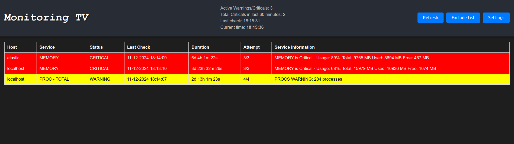

# Nagios Dashboard

Nagios Dashboard is a lightweight and efficient web-based tool for monitoring active warnings and critical alerts from a Nagios server. Designed specifically for large-screen displays in Ops rooms and control centers, it enables operations teams to keep crucial system statuses visible in real-time. Unlike existing solutions, this dashboard is optimized for large screens, making it the ideal alternative to Nagstamon.



## Key Features

- **Real-Time Refresh**: Automatically fetches data from your Nagios server at a configurable interval, ensuring that the displayed information is always up-to-date.
- **Customizable Exclusions**: Supports an exclude.txt file for excluding specific hosts or services, with wildcard ``*`` support to apply exclusions broadly.
- **Max Duration Filter**: Allows setting a maximum duration for displaying alerts, automatically hiding older notifications.
- **User-Friendly and Lightweight** : Displays essential information in a clean, easy-to-read table format, including host, service, status, last check, duration, and more.

## Why Nagios Dashboard?

Most existing Nagios solutions, such as Nagstamon, are not optimized for large-screen displays or are too resource-heavy. Nagios Dashboard is specifically designed to be lightweight, easy to configure, and perfectly suited for large displays in Ops centers where quick and actionable insights are critical. This dashboard prioritizes clarity, efficiency, and ease of use.

## Exclude Functionality (exclude.txt)

The ``exclude.txt`` file allows for granular control over which hosts or services are displayed on the dashboard. This functionality is highly flexible and supports ``*`` wildcards. Here’s how it works:

- Exclude Specific Service for a Host: You can exclude a specific service on a particular host by adding a line in the format: 
```
SERVICE_NAME:SERVER_NAME
```    
For example, if you want to exclude DISK check for server 1, you should add this line to ``exclude.txt``:
```
DISK:server1
```
- Exclude All Services for a Host: use ``*`` as the service name to exclude all services for a specific host:
```
*:server1
```
- Exclude Specific Content: Use ``ignore`` to exclude any row containing specific content in its HTML. For example if you want to ignore every passive check, you shoud use: 
```
ignore:passiveonly.gif
```
   
## Installation

1. Clone this repository: 
```bash
git clone https://github.com/krasimirstoev/nagios-dashboard.git 
cd nagios-dashboard
```
2. Install dependencies: 
```bash
npm install
```

3. Configure ``config.js`` with your Nagios server details:

Set ``nagiosUrl``, auth credentials, ``refresh_interval``, and other options as needed.

4. Start the server: 
```bash
node server.js
```
5. Open your browser and go to http://localhost:3000 to view the dashboard.

## Configuration

The config.js file contains essential settings:

- ``nagiosUrl``: URL to your Nagios status endpoint.
- ``refresh_interval``: Interval in seconds for data refresh.
- ``auth`: Credentials for accessing the Nagios server.
- ``excludeFilePath``: Path to a file containing rules for excluding specific hosts or services.
- ``max_duration``: Maximum alert duration (in days) for service to display on the dashboard.

## Contributing

Feel free to open issues or submit pull requests for new features, improvements, or bug fixes.

## License

This project is licensed under the GNU General Public License, Version 2.
